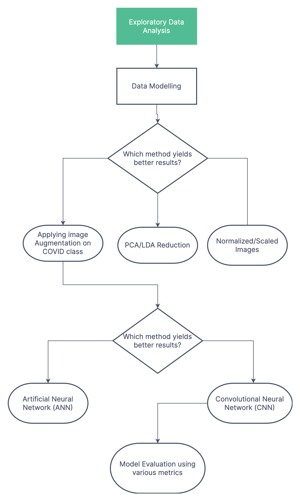
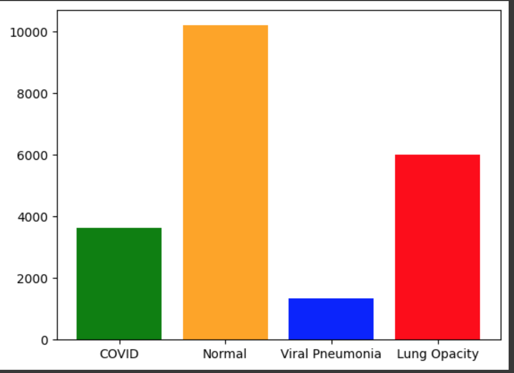
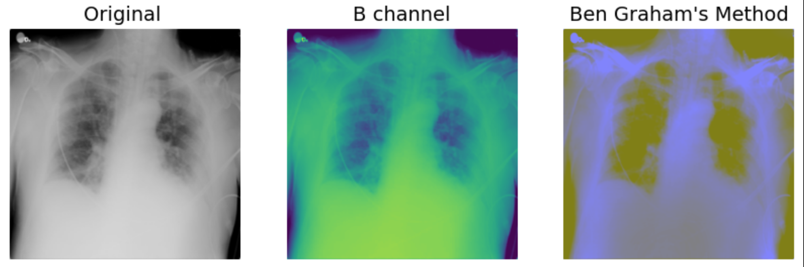
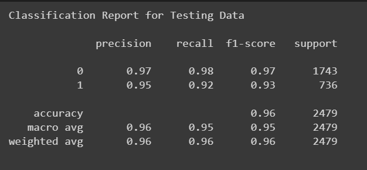
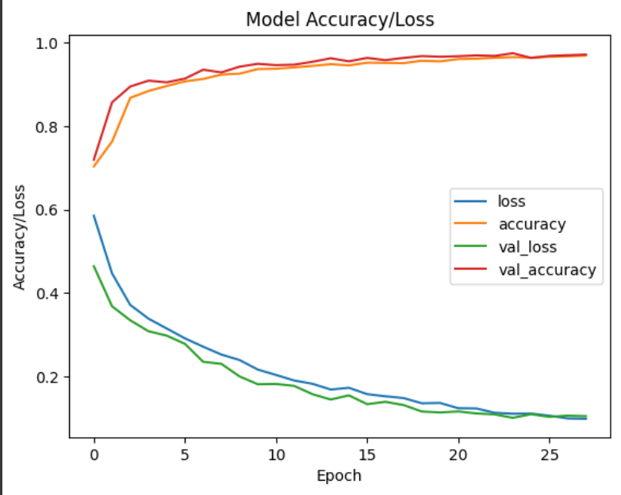
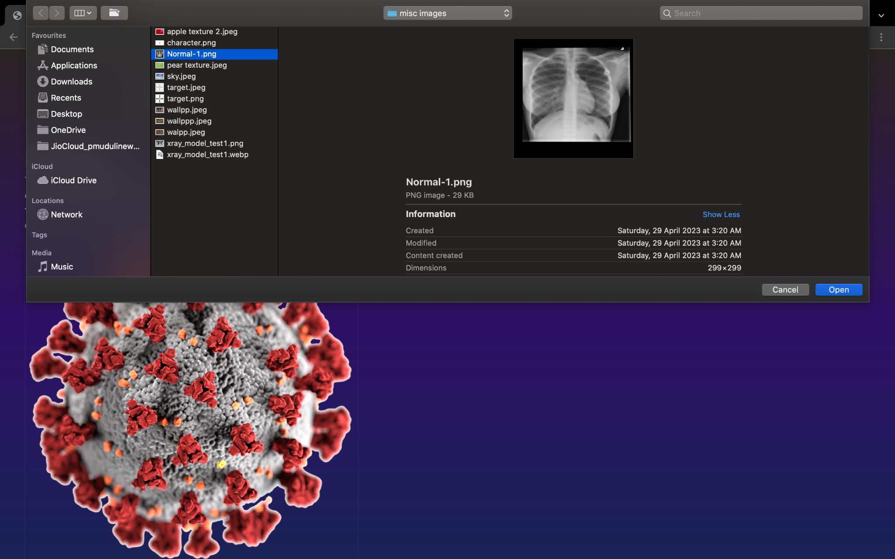
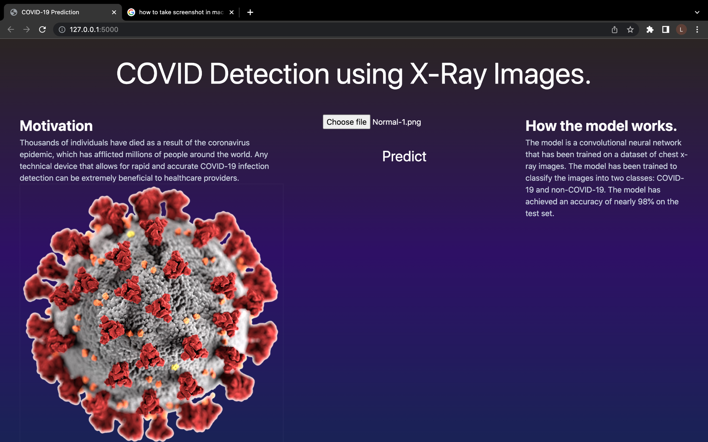
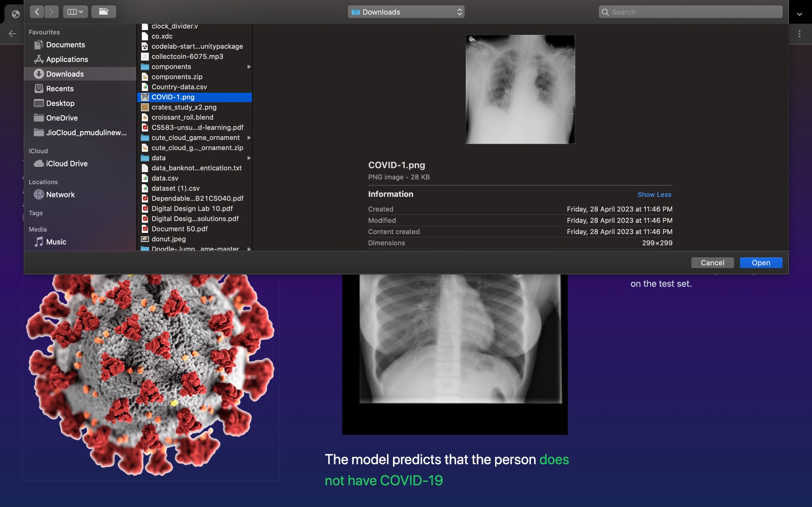
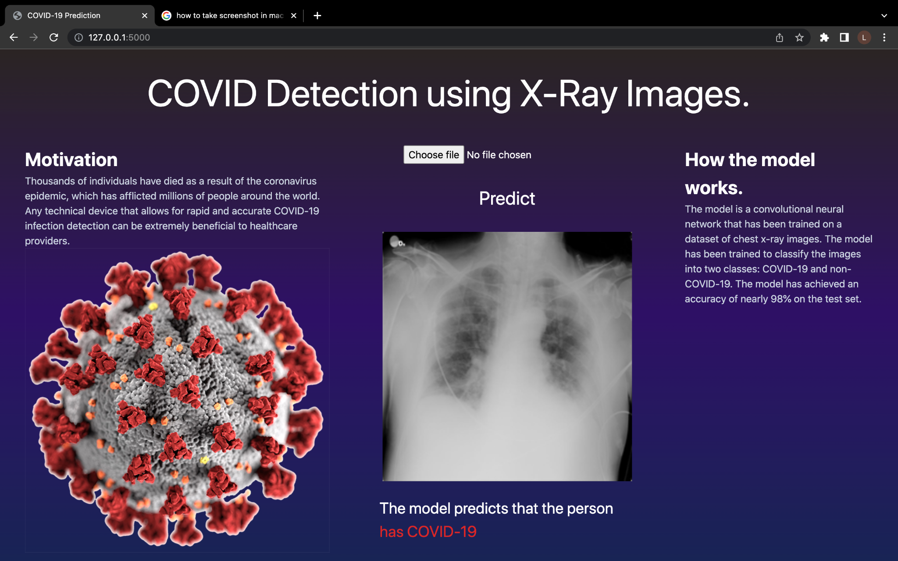

# covid_detection_using_x-rays
**COVID Detection Using X-rays**

**Machine Learning Pipeline**

**INTRODUCTION:**

A team of researchers from Qatar University, Doha, Qatar, and the University of Dhaka, Bangladesh along with their collaborators from Pakistan and Malaysia in collaboration with medical doctors have created a database of chest X-ray images for COVID-19 positive cases along with Normal and Viral Pneumonia images. Our aim in this project is to correctly classify the covid positive patients and covid negative patients based on their X-ray images.

Here is the dataset:- [**https://www.kaggle.com/datasets/tawsifurrahman/covid19-radiography-database**](https://www.kaggle.com/datasets/tawsifurrahman/covid19-radiography-database)

**EXPLORATORY DATA ANALYSIS:**

The dataset contains 21165 chest X-ray images consisting of 4 different classes: COVID, Normal, Viral Pneumonia, and Lung Opacity. COVID class has 3616 images, Normal class has 10192 images, Viral Pneumonia has 1345 images, and Lung Opacity has 6012 images. There were no duplicate or null images present in the dataset.

****

We also plotted a few images from each class to aid in the visualization.

X-Ray images were also visualized using different channels to get more insight as shown below.

****

**Data Modelling and Preprocessing**

A series of general steps were followed for processing the dataset to make it fit to begin the classification process:

-   While creating the data frame, the images were resized from size 299x299 to 80x80. This was done so as not to exceed the memory resources.
-   The images were read in grayscale mode and their RGB values were normalized by dividing the pixel values by 255.
-   Any categorical feature was converted into a numerical one.
-   The dataset was split into training, testing, and validation sets in the ratio 80:10:10.
1.  **Image Augmentation on COVID class:** One very important point that we came across while performing data analysis was that the COVID class (positive) was too few in numbers (nearly 3000) as opposed to the negative class (nearly 17000). Therefore, to even out the classes a little, the images in COVID classes were doubled in number by applying several augmentations such as rotation, cropping, blurring, etc. This prevents the model from being biased, having poor generalization, or generating unsatisfactory evaluation results.
2.  **Using the original scaled dataset:** The model was trained directly here.
3.  **PCA/LDA Reduced dataset:** In using LDA, since our task was binary classification, we could reduce the dataset to only 1 feature. This didn’t produce much improvement in accuracy. Likewise, not much improvement was observed in the case of PCA.

As it was expected, the accuracy results were better using the 1st dataset. Accuracy using the augmented dataset came out to be nearly 97.2% on the testing dataset, while the original dataset yielded an accuracy of 96.6%.

**Model Training**

In our project, we trained two different models, an Artificial Neural Network (ANN) and a Convolutional Neural Network (CNN), to solve an image classification problem. We took care to avoid overfitting in both models by using the Dropout() function.

It is well-known that CNNs perform better than ANNs for image classification tasks, and this was demonstrated in our results. Across all three datasets (training, testing, and validation), the CNN model provided much higher accuracy than the ANN model.

We also trained a multiclass classification model which could predict a person's specific condition, like if the person is normal, is infected with covid, has pneumonia, or is suffering from lung opacity. This was also made possible with the help of CNN. Although the accuracy of the model was a bit low compared to the covid identification model, it was still significant for a multiclass problem.

We also made use of **Grad-Cam** to visualize which features the model chose of most importance while classifying the data.

**Grad-CAM (Gradient-weighted Class Activation Mapping)** is a visualization technique that is used to understand which parts of an image are most important for a deep learning model's predictions. The technique works by generating a heatmap that highlights the regions of the image that the model is most sensitive to when making a prediction.

**Results**

We evaluated the performance of each model and found that the CNN model achieved significantly higher accuracy values than the ANN model for all datasets. This indicates that the CNN model was able to extract more meaningful features from the input images, leading to better classification accuracy.

| MODEL                             | Training Accuracy  | Validation Accuracy | Testing Accuracy   |
|-----------------------------------|--------------------|---------------------|--------------------|
| Artificial Neural Network(ANN)    | 0.8244552058111381 | 0.827683615819209   | 0.803549818475191  |
| Convolutional Neural Network(CNN) | 0.983151735270379  | 0.9644874899112187  | 0.972922146026623  |

The above graph is for the testing dataset

**Embedding the model on a webpage:**

After the model was trained, it was saved in our local machine using Python’s pickle module. Then, using the Flask framework of Python, the backend of the website was designed. Then the model was embedded in the website. Finally, the front-end and database handling was done. The website is now capable of taking as input an image of a chest X-ray and predicting whether the person has COVID-19 or not with 97% accuracy!

**Screenshots of the webpage:**

Choosing the X-ray image of a normal person.

****

**Hitting the predict button**

****

**Choosing the X-ray of a COVID-19-infected person**

****

**Hitting the predict button again**

****

**The entire source code of the webpage can be found at this link:** [**https://github.com/lakshmi109/COVID-Detection-Using-X-Ray**](https://github.com/lakshmi109/COVID-Detection-Using-X-Ray)

**Conclusion**

In conclusion, developing a machine learning model for predicting COVID-19 from X-ray images can potentially be a valuable diagnostic tool for healthcare professionals. By training a model on a large dataset of X-ray images, we were able to develop a model that can accurately distinguish between COVID-19 positive and negative cases.

We demonstrated our model's effectiveness in accurately diagnosing COVID-19 from X-ray images through various experiments. Our model was able to achieve high accuracy, precision, recall, and F1-score, indicating its strong performance in predicting COVID-19.

**Future Prospects**

1.  Transfer learning to related diseases: While our model is specifically designed to diagnose COVID-19, the model's skills may also apply to other related diseases, such as pneumonia or bronchitis. Investigating how transfer learning could be used to apply your model to these diseases could be a valuable area of research.
2.  Integration with other diagnostic tools: While our model can be used as a standalone diagnostic tool, it could also be integrated with other diagnostic tools, such as clinical data or lab results, to provide a more comprehensive picture of a patient's health. Investigating how our model could be combined with other diagnostic tools could be a valuable area of research.
3.  Expansion to other populations: Our model may have been trained on a specific population or set of populations, such as Qatar, Bangladesh, etc. Investigating how our model performs on other populations, such as different ethnicities or age ranges, could be an important area of research to ensure that our model applies to a wide range of patients.

